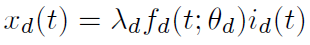

# Usage

This is a introduction to the usage of run.py, which is used to start training Encoder-Decoder or Influence and Susceptibility model.

## Arguments

-tool: 'ed', 'dh', 'lis', 'rpp', 'atten' or 'sg', indicating wich tool you want to use;

'ed':

    -mode: 'benchmark' or 'SNAP' for Encoder-Decoder, the mode in which this tool runs

    -net: the path of network file

    -com: the path of community file for Encoder-Decoder

    -k: the parameter k for Encoder-Decoder

    -label: the path of label file for Encoder-Decoder

'lis':

    -mode: 'with_time' or 'processed' for Influence and Susceptibility, the mode in which this tool runs

    -N: the number of nodes/items in network

    -feature: the length of Influence/Susceptibility vector

    -dat: the path of training data file

    -l: the length of cascade context for Influence and Susceptibility

    -ite: the number of iteration

    -batch: the size of batch

    -lmd: the scaling factor value for Influence and Susceptibility

    -lr: the learning rate

    -cas: the path of cascade (with time) file for Influence and Susceptibility

'rpp':

    -mode: 'without_prior' or 'with_prior' for Reinforced Poisson Processes, the mode in which this tool runs

    -N: the number of nodes/items in network

    -T: training period for Reinforced Poisson Processes

    -m: effective number of attentions for Reinforced Poisson Processes

    -lr: the learning rate

    -dat: the path of training data file

    -ite: the number of iteration

    -batch: the size of batch

'sg':

    -mode: 'UIC' or 'WIC' for StaticGreedy, the mode in which this tool runs

    -dat: the path of training data file

    -dataset: 'DBLP', 'hep', 'phy' or 'slashdot'

    -k: the number of seed nodes

    -algorithm: 'CELF' or 'DU', the algorithm you want to use

'atten':

    -dat_tra: the path of training data file

    -dat_tes: the path of testing data file

    -dat_val: the path of validating data file

    -lr: the learning rate

    -batch: the size of batch

##Introduction

(ed)The Encoder-Decoder model is a kind of non-negative matrix factorization. The original input is represented as a matrix A, where each row corresponds to a feature and each column corresponds to a sample or an instance over these features. As for the task of community detection, A is always the adjacency matrix. This model aims to factorize the original input matrix A into a basis matrix W and a code matrix Z, which are both non-negative. The size of A, W, Z is n × m, n × k, k × m respectively. It has an encoder and a decoder.

An encoder requires that Z ≈ W^TA and a decoder constrains A ≈ WZ, resulting in A ≈ WW^TA. Thus the basis matrix W is non-negative and sparse, which makes it well reveal the community structure of original input data.

We adopt the "benchmark" tool to generate synthetic network dataset.

And we adopt the Amazon dataset and the DBLP dataset provided in the SNAP project for our example.

(dh)The DeepHawkes model is proposed to predict the popularity of information. It combats the defects of existing mothods, leveraging end-to-end deep learning to make an anology to interpretable factors of Hawkes process.

DeepHawkes inherits the high interpretability of Hawkes process and possesses the high predictive prwer of deep learning methods, bridging the gap between prediction and understaneding of information cascades.

We publish the Sina Weibo Dataset used in our paper,i.e., dataset_weibo.txt. It contains 119,313 messages in June 1, 2016. Each line contains the information of a certain message, the format of which is:

<message_id>\tab<user_id>\tab<publish_time>\tab<retweet_number>\tab<retweets>

This dataset is limited to only use in research. And when you use this dataset, please cite our paper as listed above.

Downlowd link: https://pan.baidu.com/s/1c2rnvJq  password: ijp6

(lis)The Influence and Susceptibility model describes the cascade dynamics by learning two low-dimensional user-specific

vectors from observed cascades, capturing their influence and susceptibility respectively.

In this latent influence and susceptibility (LIS) model, the propagation probability that one user forwards a piece of information is determined by the product of her activated neighbors’ influence vectors and her own susceptibility vector. 

This model requires much less parameters than traditional pair-wise methods which use n^2 independent parameters for n users and thus this model could combat overfitting problem. Moreover, it could naturally model context-dependent factors like cumulative effect in information propagation.

We first generate two synthetic diffusion networks: one is constructed using Barabasi-Albert model; the other is generated by shuffling the original network.

Then we using the Microblog data from Sina Weibo website which is published by WISE 2012 challenge, spanning from January 1, 2011 to Feburary 15, 2011.

(rpp)The Reinforced Poisson Processes model describes the stochastic popularity dynamic, simultaneously capturing three key ingredients: fitness of an item, characterizing its inherent competitiveness against other items; a general temporal relaxation function, corresponding to the aging in the ability to attract new attentions; and a reinforcement mechanism, documenting the well-known “rich-get-richer” phenomenon.

For an individual item d, we model its popularity dynamics as a reinforced Poisson process (RPP) characterized by the rate function *xd(t)* as

where *λd* is the intrinsic attractiveness, *fd(t; θd)* is the relaxation function that characterizes the temporal inhomogeneity due to the aging effect modulated by parameters *θd*, and *id(t)* is the total number of attentions received up to time *t*. From a Bayesian viewpoint, the total number of attentions *id(t)* is the sum of the number of real attentions and the effective number of attentions which plays the role of prior belief.

The benefit of the proposed model is three fold: (1) It models the arrival process of individual attentions directly in contrast to relying on aggregated popularity time series; (2) As a generative probabilistic model, it can be easily incorporated into the Bayesian framework to account for external factors, hence leading to improved predictive power; (3) The flexibility in its choice of specific relaxation functions makes it a general framework that can be adapted to model the popularity dynamics in different domains.

We conduct experiments on an excellent longitudinal dataset, containing all papers and citations from 11 journals of American Physical Society between 1893 and 2009.

The format of dataset is: <Time_1>\tab<Time_2>\tab......\tab<Time_n>

(Att)This project is implemented based on the article “Cascade Dynamics Modeling with Attention-based Recurrent Neural Network”. This paper proposes an attention-based RNN to capture the cross-dependence in cascade, one sharing behavior could be triggered by its non-immediate predecessor in the memory chain. In our model, we use all precious resharing behavior (user and its resharing time in cascade) to predict the next resharing behavior. You can find more detail in this paper.

We use synthetic data to validate the effectiveness of our proposed models in cascade prediction tasks under different underlying network structure and different diffusion models. The Kroneck generator mentioned in the paper can be found in “Stanford Network Analysis Project” (http://snap.stanford.edu/). You can generate the database following the instruction in the paper.

(SG)This project is implemented based on the article “StaticGreedy: Solving the Scalability-Accuracy Dilemma in Influence Maximization”. It proposed this StaticGreedy model to solve scalability-accuracy dilemma by guaranteeing the submodularity of influence spread function during the seed selection process. We input the whole graph into the model and finally we find a set of points who can get the most influence to this graph. You can get more details from the paper.

We use four databases to illustrate the performance of our algorithm, three undirected scientific collaboration networks (NetHEPT, NetPHY, and DBLP) and a directed online social network (Slashdot). The paper will tell you where to download.

(Link of collaboration networks: https://www.microsoft.com/en-us/research/people/weic/?from=http%3A%2F%2Fresearch.microsoft.com%2Fen-us%2Fpeople%2Fweic%2F#!selected-projects) 

(Link of directed online social network: http://snap.stanford.edu/data/index.html)

We only use python to implement this model. You can find some ways to speed up this model (PyPy, multiprocessing). 

##Examples

Run Encoder-Decoder model on synthetic network:

	python run.py -tool ed -mode benchmark -net ./ed/data_set/network_500.dat -com ./ed/data_set/community_500.dat -k 30

Run Encoder-Decoder model on DBLP network:

	python run.py -tool ed -mode SNAP -net ./ed/data_set/com-dblp.ungraph.txt -label ./ed/data_set/com-dblp.all.cmty.txt -k 100

Run DeepHawkes model:

	python run.py -tool dh

Run Influence and Susceptibility model on processed Microblog network:

	python run.py -tool lis -mode processed -dat ./lis/data_set/train.dat.1 -N 199408 -feature 20 -l 0 -ite 50000 -batch 64 -lmd 0.01 -lr 0.001

Run Influence and Susceptibility model on small unprocessed network:

	python run.py -tool lis -mode with_time -cas ./lis/data_set/nd1000_tm_cmplt_train -net ./lis/data_set/train_net -N 1000 -feature 5 -l 20 -ite 50000 -batch 64 -lmd 0.01 -lr 0.001

Run Reinforced Poisson Processes model without prior:

	python run.py -tool rpp -mode without_prior -N 2786 -T 3650 -m 30 -dat ./rpp/data_set/cas_PR.txt -lr 1e-3

Run Reinforced Poisson Processes model with prior:
  
	python run.py -tool rpp -mode with_prior -T 3650 -N 2786 -m 30 -dat ./rpp/data_set/cas_PR.txt -lr 1e-3 -batch 64 -ite 18000

Run StaticGreedy-UIC model:

	python run.py -tool sg -dat ./sg/dblp.txt -k 50 -dataset DBLP -mode UIC -algorithm CELF

Run StaticGreedy-WIC model:
  
	python run.py -tool sg -dat ./sg/dblp.txt -k 50 -dataset DBLP -mode WIC -algorithm DU

Run Attention-based model:

	python run.py -tool atten -dat_tra ./atten/net32-cp-exp-cascades.train -dat_tes ./atten/net32-cp-exp-cascades.test -dat_val ./atten/net32-cp-exp-cascades.val -batch 32