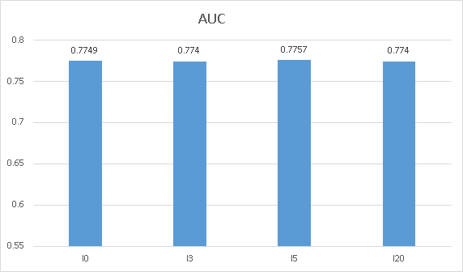

# Influence and Susceptibility

This repository is a implementation of Influence and Susceptibility model of information cascades proposed in the following paper:

> Wang, Yongqing, et al. "Learning user-specific latent influence and susceptibility from information cascades." (2013):477-483.

## Introduction

The Influence and Susceptibility model describes the cascade dynamics by learning two low-dimensional user-specific
vectors from observed cascades, capturing their influence and susceptibility respectively.

In this latent influence and susceptibility (LIS) model, the propagation probability that one user forwards a piece of information is determined by the product of her activated neighbors’ influence vectors and her own susceptibility vector. 

This model requires much less parameters than traditional pair-wise methods which use n^2 independent parameters for n users and thus this model could combat overfitting problem. Moreover, it could naturally model context-dependent factors like cumulative effect in information propagation.

## DataSet

In order to demonstrate the performance of this model, we adopt the Microblog data from Sina Weibo website which is published by WISE 2012 Challenge to evaluate this model.

## Steps to run the model

1.(optional) convert cascade data with time and network data to the data whose format the program can recognize

command:

    python3 converter.py -N node_num -net network_file_path -cas cascade_file_path -out output_file_path

2.run the model to learn the user-specific vectors

command:

    python3 LIS.py -N node_num -feature featrue_vector_length -l cascade_context_length -ite iteration_num -batch batch_size -dat train_data_file_path -lmd scaling_factor_value -lr learning_rate

3.(optional) calculate the AUC value to evaluate the output

command:

	python3 eval_AUC.py -N node_num -feature featrue_vector_length -l cascade_context_length -dat test_data_file_path -lmd scaling_factor_value -matrix_i influence_vector_file_path -matrix_s susceptibility_vector_file_path

## My results

On the first of three Microblog datasets, setting the length of featrue vector to 20, the results of AUC with different cascade context length configured are shown as follows:

