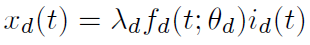
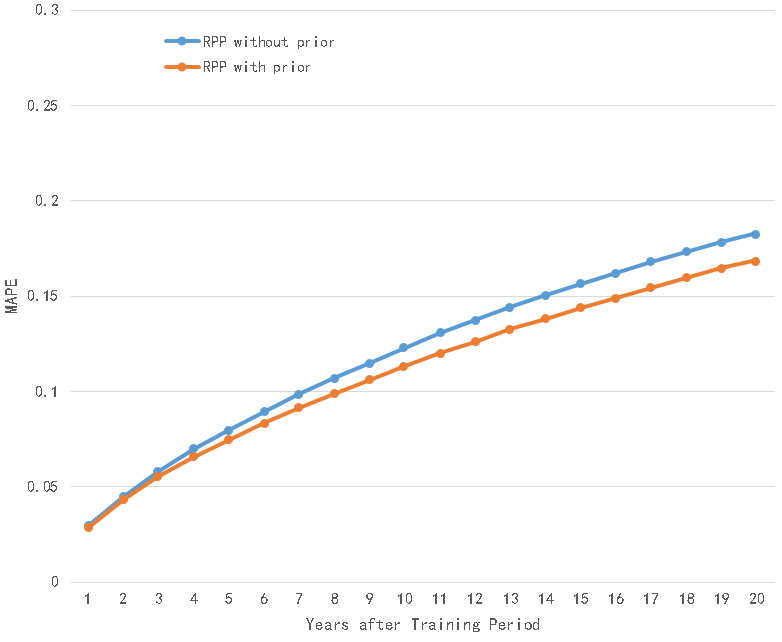
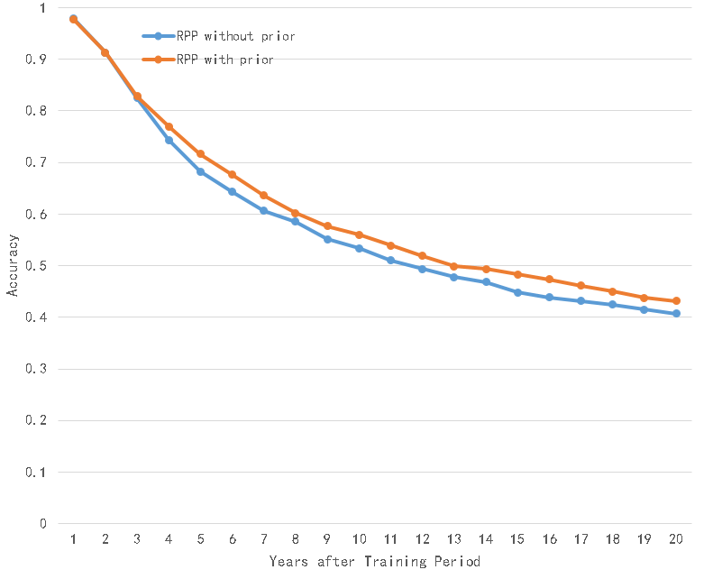

# Reinforced Poisson Processes

This repository is a implementation of Reinforced Poisson Processes model used to pridict popularity dynamics which was proposed in the following paper:

> Shen, Hua Wei, et al. "Modeling and Predicting Popularity Dynamics via Reinforced Poisson Processes." 1(2014):291-297.

## Introduction

The Reinforced Poisson Processes model describes the stochastic popularity dynamic, simultaneously capturing three key ingredients: fitness of an item, characterizing its inherent competitiveness against other items; a general temporal relaxation function, corresponding to the aging in the ability to attract new attentions; and a reinforcement mechanism, documenting the well-known “rich-get-richer” phenomenon.

For an individual item d, we model its popularity dynamics as a reinforced Poisson process (RPP) characterized by the rate function *xd(t)* as

where *λd* is the intrinsic attractiveness, *fd(t; θd)* is the relaxation function that characterizes the temporal inhomogeneity due to the aging effect modulated by parameters *θd*, and *id(t)* is the total number of attentions received up to time *t*. From a Bayesian viewpoint, the total number of attentions *id(t)* is the sum of the number of real attentions and the effective number of attentions which plays the role of prior belief.

The benefit of the proposed model is three fold: (1) It models the arrival process of individual attentions
directly in contrast to relying on aggregated popularity time series; (2) As a generative probabilistic model, it can be easily incorporated into the Bayesian framework to account for external factors, hence leading to improved predictive power; (3) The flexibility in its choice of specific relaxation functions makes it a general framework that can be adapted to model the popularity dynamics in different domains.

## DataSet

Taking citation system as an exemplary case, in order to demonstrate the performance of this model, we adopt the a dataset peculiar in its longitudinality, spanning over 100 years and containing all the papers ever published by American Physical Society.

## Steps to run the model

1.run the model to learn the parameters

command:

    python3 RPP.py -T training_period -N number_of_items -m effective_number_of_attentions -dat training_data_file_path -lr learning_rate

or:

    python3 RPP_prior.py -T training_period -N number_of_items -m effective_number_of_attentions -dat training_data_file_path -lr learning_rate -batch batch_size -ite iteration_num

2.(optional) calculate MAPE and accuracy to evaluate the output

command:

	python3 eval.py -N number_of_items -T training_period -m effective_number_of_attentions -ET prediction_period -dat evaluation_data_file_path -itv output_time_interval -out training_output_file_path

or:

	python3 eval_prior.py -N number_of_items -T training_period -m effective_number_of_attentions -ET prediction_period -dat evaluation_data_file_path -itv output_time_interval -out training_output_file_path

## My results

On the first collection: papers published in Physical Review from 1960 to 1969, setting training period to 10 years and *m* to 30, the results are shown as follows: 

